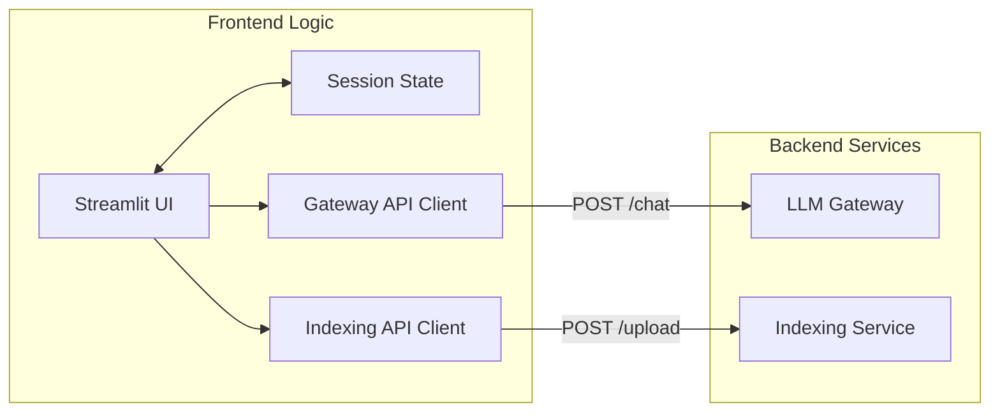

# Frontend Service

## Overview
The **Frontend Service** provides a user-friendly web interface for the Vietnamese Law LLM Platform. Built with **Streamlit**, it offers a reactive CLI-like experience for chatting with the AI and an administrative panel for managing the knowledge base.

## Architecture
The frontend acts as a client that consumes APIs from the backend microservices. It does not contain business logic but focuses on state management and UI rendering.

### Component Interaction


## Features
1.  **Chat Interface (Hỏi Đáp)**:
    - Interactive chat UI with message history.
    - Automatic state management (session persistence).
    - Real-time feedback (loading indicators, error handling).
2.  **Knowledge Base Management (Nạp Kiến Thức)**:
    - File uploader for PDF documents.
    - Progress tracking and processing timer.
    - Detailed result feedback (number of chunks indexed).

## Configuration
Environment variables:
- `LLM_GATEWAY_URL`: Endpoint for the Chat API (e.g., `http://llm-gateway:8001`).
- `INDEXING_SERVICE_URL`: Endpoint for the Indexing API (e.g., `http://indexing-service:5001`).

## Development
To run locally utilizing the docker network:
```bash
# Ensure backend services are running via Docker Compose
docker-compose up -d

# Run Streamlit
streamlit run src/main.py
```
*Note: When running locally outside Docker, you might need to adjust env vars to point to `localhost` ports.*
