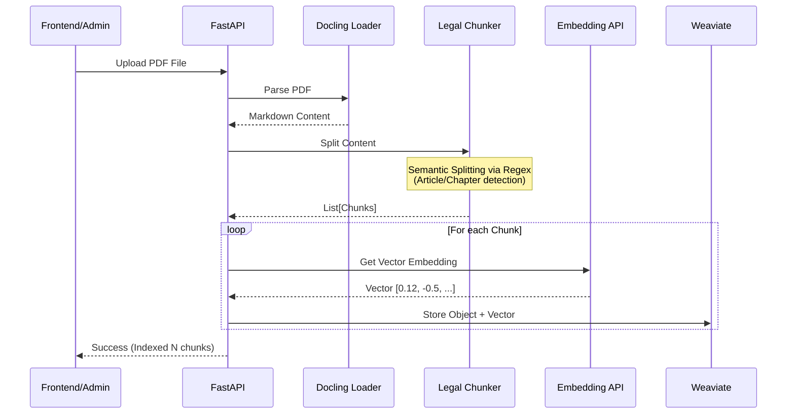

# Indexing Service

## Overview
The **Indexing Service** is responsible for ingesting legal documents (mainly PDF), processing them into meaningful chunks, and indexing them into the Vector Database (Weaviate). This ensures that the RAG system has an up-to-date and searchable knowledge base.

## Architecture
This service uses a pipeline approach to transform raw files into vector embeddings.

### Indexing Pipeline


## Key Components
1.  **Docling Loader**: Uses `docling` library to intelligently parse PDF documents, preserving structure (headers, tables) and converting them to Markdown.
2.  **Legal Chunker**: A specialized chunking strategy optimized for Vietnamese Law. It splits text based on legal hierarchy (`Chương`, `Điều`, `Khoản`) rather than just character count.
3.  **Embedding Client**: Communicates with the `embedding-api` to convert text chunks into vector representations.
4.  **Weaviate Client**: Manages the schema and insertion of data into the Weaviate Vector DB.

## Configuration
Environment variables:
- `EMBEDDING_API_URL`: URL of the embedding service.
- `WEAVIATE_URL`: URL of the Weaviate instance.

## API Endpoints
### `POST /api/v1/indexing/upload`
Upload and index a PDF file.

**Request:** `multipart/form-data`
- `file`: The PDF file to upload.

**Response:**
```json
{
  "message": "Đã index thành công 150 chunks.",
  "filename": "luat-dat-dai.pdf"
}
```

### `GET /`
Service status check.
