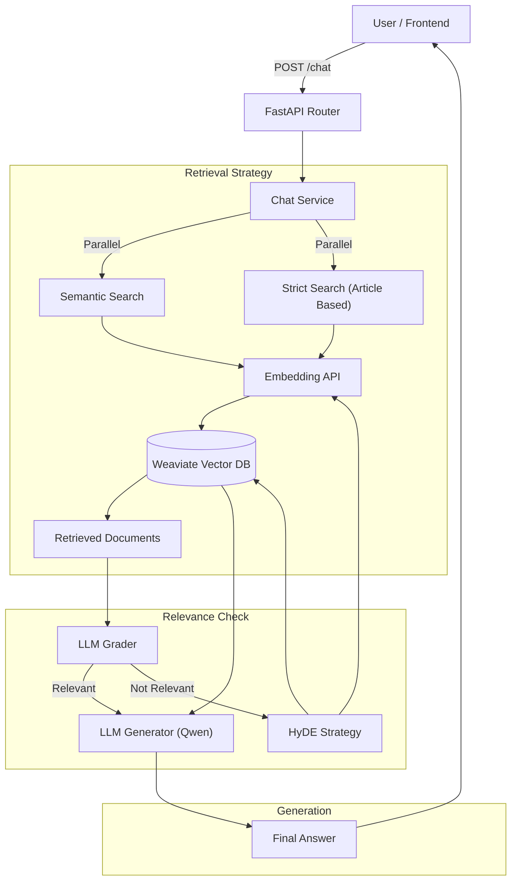

# LLM Gateway Service

## Overview
The **LLM Gateway** is the central intelligence unit of the Vietnamese Law RAG platform. It acts as an orchestrator that handles user queries, manages retrieval strategies (Semantic Search, Hybrid Search), performs document grading, and generates final responses using a locally hosted Large Language Model (Qwen).

## Architecture
The service follows **Clean Architecture** principles with a clear separation of concerns:
- **Presentation**: FastAPI routers handling HTTP requests.
- **Application**: Core business logic (ChatService) orchestrating the RAG flow.
- **Domain**: Interfaces (Ports) and Data Models.
- **Infrastructure**: Adapters for external tools (Weaviate, Embedding API, Local LLM).

### Operational Flow


## Key Features
- **Parallel Retrieval**: Combines semantic search (vector-based) with strict keyword search (specific legal articles like "Điều 100").
- **Relevance Grading**: Uses a "Self-Correction" mechanism where the LLM grades the retrieved documents. If they are irrelevant, it triggers fallback mechanisms.
- **HyDE (Hypothetical Document Embeddings)**: Generates a hypothetical answer to improve retrieval when initial search fails.
- **Local LLM**: Runs `Qwen/Qwen3-0.6B` (or configured model) locally with optimization for low VRAM usage.

## Configuration
Environment variables in `docker-compose.yml`:
- `WEAVIATE_URL`: URL of the Weaviate Vector DB.
- `EMBEDDING_API_URL`: URL of the external Embedding Service.
- `MODEL_NAME`: HuggingFace model ID (default: `Qwen/Qwen3-0.6B`).

## API Endpoints
### `POST /api/v1/chat`
Process a natural language query.

**Request:**
```json
{
  "query": "Quy định về tội lừa đảo?"
}
```

**Response:**
```json
{
  "answer": "Theo Điều 174 Bộ luật Hình sự...",
  "sources": ["Bộ luật Hình sự 2015", "Điều 174"]
}
```

### `GET /health`
Health check endpoint.
